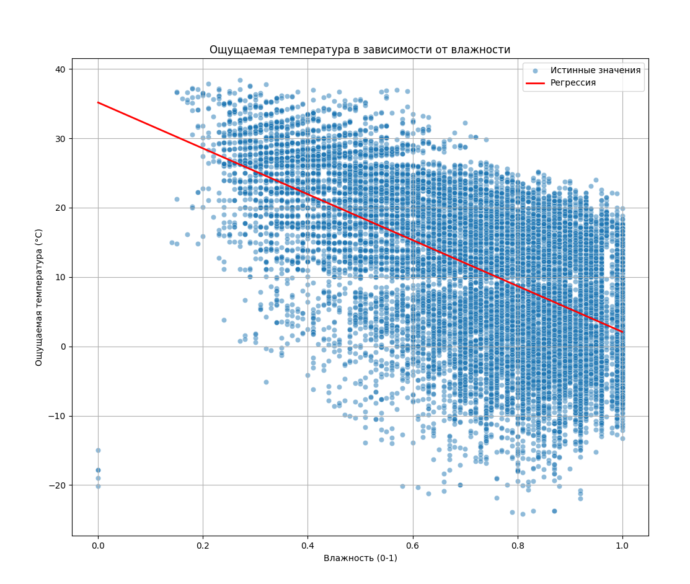
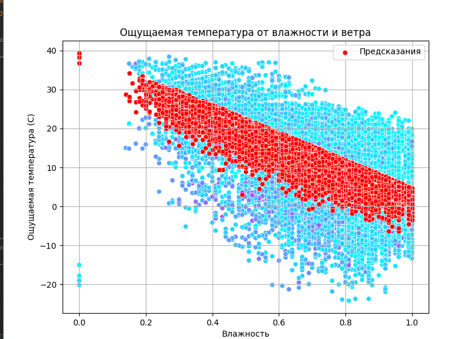

# Лабораторная работа №1: Регрессионный анализ погоды

## 📝 Описание проекта

В рамках данной работы были построены и исследованы две модели линейной регрессии для предсказания ощущаемой температуры на основе данных о влажности и скорости ветра из набора данных "Weather in Szeged 2006-2016".

## 🎯 Поставленные задачи

1.  **Подготовить данные:** Загрузить набор данных, выбрать необходимые столбцы (`Humidity`, `Wind Speed (km/h)`, `Apparent Temperature (C)`) и провести их очистку.
2.  **Построить простую регрессионную модель:** Создать модель, которая предсказывает ощущаемую температуру на основе влажности.
3.  **Визуализировать простую модель:** Построить диаграмму рассеяния и наложить на нее линию регрессии.
4.  **Построить множественную регрессионную модель:** Усложнить модель, добавив в качестве второго предиктора скорость ветра.
5.  **Визуализировать множественную модель:** Отобразить результаты работы второй модели.
6.  **Создать тестовый стенд:** Реализовать консольный интерфейс для демонстрации работы обеих моделей на вводимых пользователем данных.

## ⚙️ Результаты работы

### 1. Модель 1: Зависимость температуры от влажности

Была построена простая линейная регрессия, где в качестве предиктора выступает только влажность. Как видно из графика, существует обратная зависимость: с ростом влажности ощущаемая температура снижается.

*Рис. 1 — Диаграмма рассеяния и линия регрессии для модели, использующей только влажность.*

### 2. Модель 2: Зависимость от влажности и скорости ветра

Для повышения точности в модель был добавлен второй предиктор — скорость ветра. Эта модель является более комплексной и точной.

*Рис. 2 — Визуализация предсказаний модели, учитывающей влажность и скорость ветра.*

### 3. Сравнение моделей и тестовый стенд

Для сравнения эффективности моделей была рассчитана метрика **RMSE** (корень из среднеквадратичной ошибки). Чем ниже RMSE, тем точнее модель.

-   RMSE Модели 1 (только влажность): **8.61**
-   RMSE Модели 2 (влажность + ветер): **8.35**

Как показывают метрики, добавление скорости ветра в качестве предиктора улучшило качество модели, снизив ошибку предсказания.

Для демонстрации работы был реализован консольный тестовый стенд, который принимает на вход значения влажности и скорости ветра и выводит предсказания обеих моделей.

*Рис. 3 — Вывод с метриками моделей и пример работы консольного тестового стенда.*