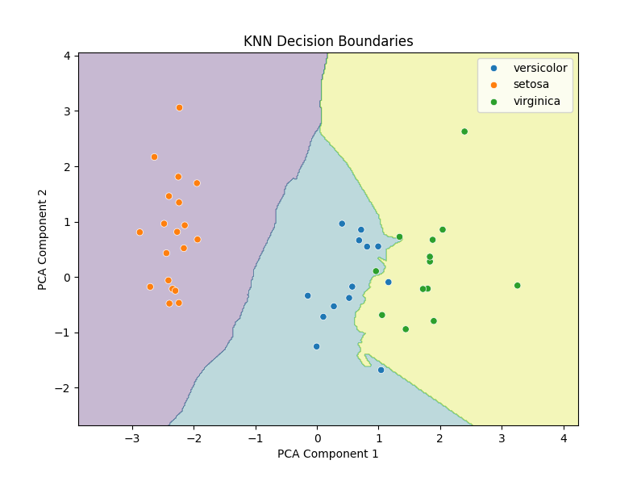
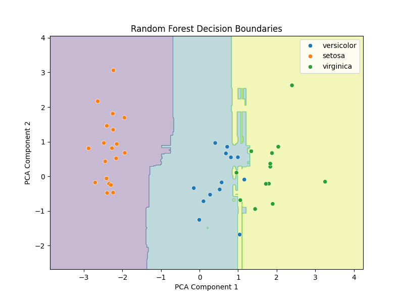
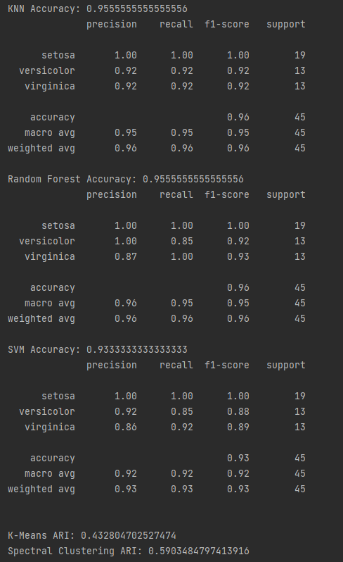
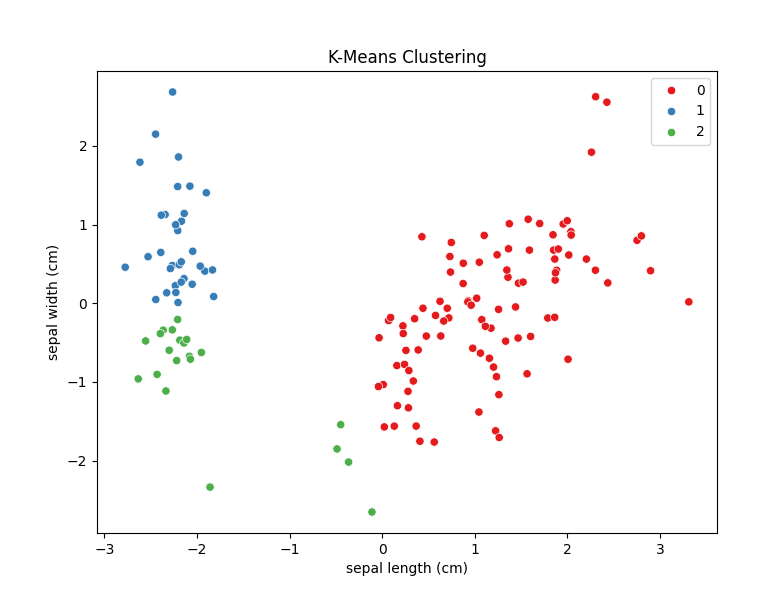
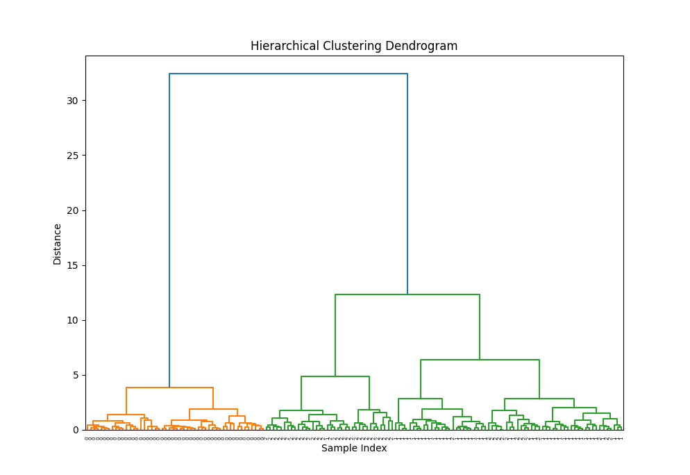
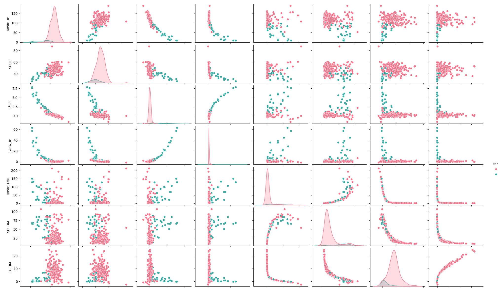
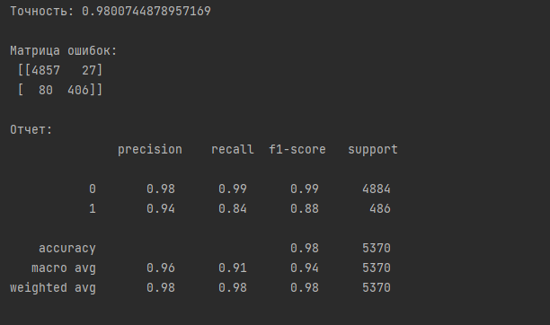
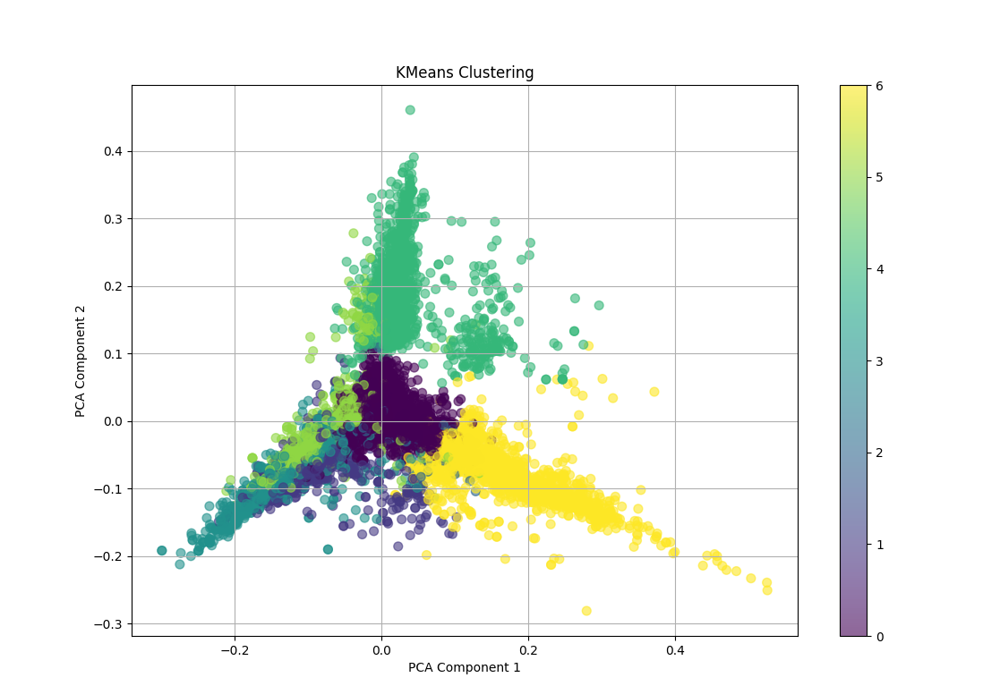
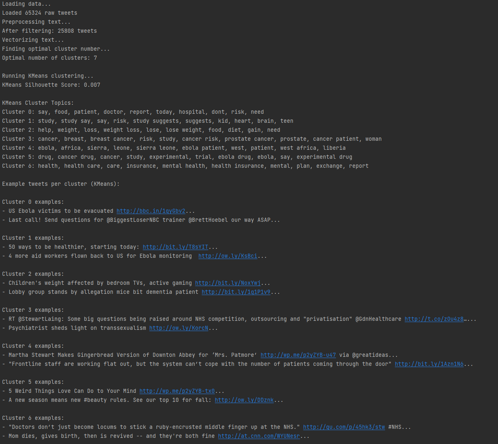

# Лабораторная работа №3: Решение задач классификации и кластеризации

В рамках данной работы были исследованы и применены различные алгоритмы машинного обучения для решения задач классификации и кластеризации на нескольких наборах данных.

---

## Часть 1. Исследование набора данных "Ирисы Фишера"

Для классического набора данных "Ирисы Фишера" были применены три алгоритма классификации и три алгоритма кластеризации.

### 1.1. Классификация

#### Метод k-ближайших соседей (k-NN)
Алгоритм определяет класс объекта на основе классов его соседей.

*Рис. 1 — Визуализация разделения ирисов на классы методом k-NN.*

#### Случайный лес (Random Forest)
Ансамблевый метод, использующий множество решающих деревьев для повышения точности.

*Рис. 2 — Границы принятия решений, построенные алгоритмом "Случайный лес".*

#### Машина опорных векторов (SVM)
Метод строит гиперплоскости в многомерном пространстве для разделения классов.

*Рис. 3 — Результат классификации ирисов с помощью SVM.*

*Рис. 4 — Сводный отчет о точности работы алгоритмов классификации.*

### 1.2. Кластеризация

#### Метод k-средних (k-Means)
Алгоритм разделяет данные на k кластеров, минимизируя расстояние от точек до центров их кластеров.

*Рис. 5 — Разделение данных на кластеры методом k-средних.*

#### Иерархическая кластеризация (метод Уорда)
Метод строит иерархию кластеров в виде дендрограммы.

*Рис. 6 — Дендрограмма, построенная методом иерархической кластеризации.*

---

## Часть 2. Классификация пульсаров (HTRU2)

Исследован набор данных о пульсарах HTRU2 с целью построения модели, способной отличать сигналы от пульсаров и от шума.

### Анализ данных
Для визуального анализа взаимосвязей между признаками был использован `pairplot`.

*Рис. 7 — Визуальный анализ признаков датасета HTRU2.*

### Результаты классификации
Была обучена модель классификации, которая показала высокую точность.

*Рис. 8 — Матрица ошибок и отчет о классификации для модели пульсаров.*

---

## Часть 3. Кластеризация новостных публикаций

Исследован набор данных с публикациями о здоровье из Twitter для их автоматической группировки по темам.

### Результаты кластеризации
Применение алгоритмов кластеризации позволило сгруппировать схожие по содержанию твиты.

*Рис. 9 — Визуализация кластеров новостных публикаций.*

*Рис. 10 — Пример содержимого одного из кластеров.*