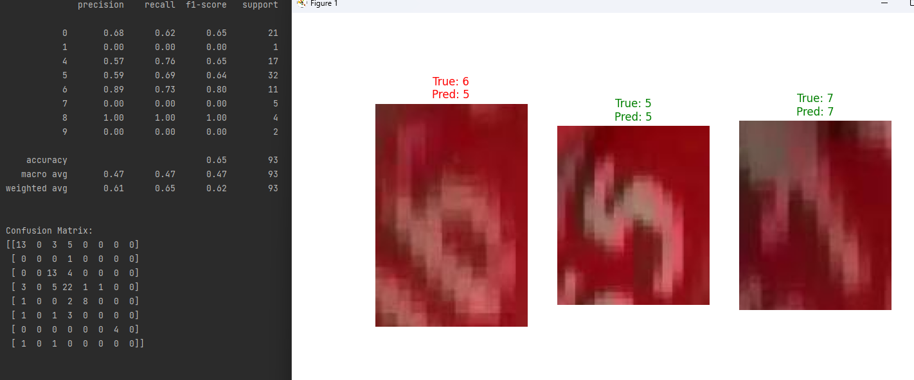
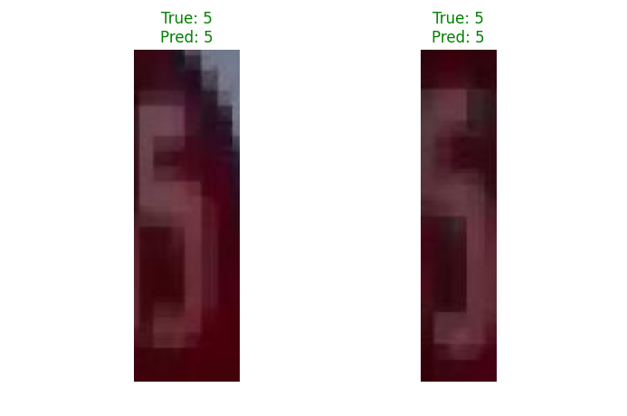
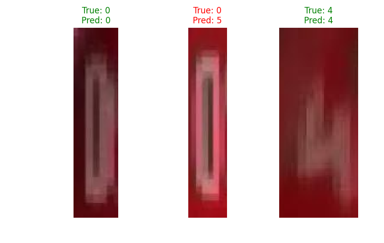

 # Лабораторная работа №4: Детектирование номеров тормозных башмаков

## 📝 Описание проекта

В рамках данной работы проведено исследование и сравнение двух методов для распознавания цифр на тормозных башмаках: классического подхода на основе фонтанного преобразования и современного, использующего нейросеть YOLO.

## Задачи
 1. Загрузить набор данных «Номера тормозных башмаков»
 2. Провести предварительный анализ набора данных, провести оценку качества
 набора данных, указать возможные пути улучшения набора данных
 3. Ознакомиться с материалами теории алгоритма фонтанного преобразования
 4. Разработать модуль распознавания номера башмака при помощи фонтанного
 преобразования
 5. Ознакомиться с материалами по архитектуре YOLOv11
 6. Загрузить предобученную модель YOLOv11 для решения задачи
 распознавания цифр как подвида задачи детектирования объектов/
 сегментации изображений
 7. Разработать модуль распознавания номера башмака при помощи YOLOv11
 8. Провести сравнительный анализ эффективности методов фонтанного
 преобразования и модели на архитектуре YOLOv11 для решения задачи
 распознавания номера тормозного башмака.
 9. Сделать сравнительную таблицу с достоинствами, недостатками каждого
 алгоритма, особое внимание уделить точности и скорости работ
 

---

## 🌊 Метод 1: Фонтанное преобразование + SVM

### Принцип работы
Данный метод основан на классических алгоритмах компьютерного зрения:
1.  **Сегментация:** Из исходного изображения вырезается область с цифрой (ROI).
2.  **Предобработка:** Изображение преобразуется в оттенки серого, бинаризуется и нормализуется по размеру.
3.  **Извлечение признаков:** С помощью "фонтанного" преобразования находятся контуры цифры, которые формируют вектор признаков.
4.  **Классификация:** Обученная модель `SVM` (машина опорных векторов) классифицирует полученный вектор признаков.

### Результаты
Точность метода сильно зависит от качества изображения и четкости контуров.

*Рис. 1 — Отчет о классификации и примеры работы метода.*

*Рис. 2 — Корректное распознавание цифры "5".*

*Рис. 3 — Ошибочное распознавание цифры "0" как "5".*

---

## 🚀 Метод 2: Детекция с помощью YOLO

### Принцип работы
Этот подход использует современную нейросетевую архитектуру для детекции объектов.
1.  **Подготовка данных:** Был вручную размечен и аугментирован набор данных для создания кастомного датасета.
2.  **Обучение модели:** На подготовленном датасете была обучена модель YOLO для распознавания цифр от 0 до 9.
3.  **Детекция:** Обученная модель применяется к изображениям для обнаружения и классификации номеров.

### Результаты
Модель YOLO демонстрирует высокую точность и устойчивость к различным условиям съемки, таким как освещение, ракурс и качество изображения.

*Рис. 4 —  детекция и классификация нескольких цифр на одном изображении.*

*Рис. 5 — детекция и классификация нескольких цифр на одном изображении.*

*Рис. 6 — детекция и классификация нескольких цифр на одном изображении.*

---

## 📊 Вывод

В ходе выполнения лабораторной работы я сравнил два метода и пришел к следующим выводам:

**Фонтанное преобразование + SVM:**
*   **Принцип работы:** Это классический подход. Сначала мы обрабатываем картинку, чтобы выделить контуры цифры, а потом пытаемся понять, что это за цифра.
*   **Точность:** Точность оказалась средней. Метод сильно зависит от того, насколько качественное изображение на входе — любой шум, блик или плохая сегментация сильно портят результат.
*   **Подготовка:** Главная сложность — подобрать правильные параметры для обработки изображений. Приходится много экспериментировать, чтобы контуры определялись корректно.
*   **Скорость:** Работает он не очень быстро, так как обработка идет в несколько этапов для каждого изображения.

**YOLO:**
*   **Принцип работы:** Это уже современный подход с использованием нейросетей. Модель сразу "смотрит" на все изображение и сама находит, где находятся цифры и какие они.
*   **Точность:** Точность высокая. Модель оказалась очень устойчивой к разным искажениям, плохому освещению и разным ракурсам.
*   **Подготовка:** Самая трудоемкая часть — это подготовка данных. Мне пришлось вручную разметить много картинок и запустить процесс обучения модели, что требует времени и вычислительных ресурсов.
*   **Скорость:** Скорость распознавания очень высокая, что позволяет использовать модель в системах, работающих в реальном времени.

Современный подход с использованием **YOLO** показал себя значительно эффективнее для данной задачи, обеспечивая высокую точность и надежность распознавания.

