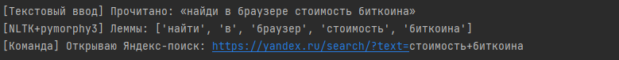
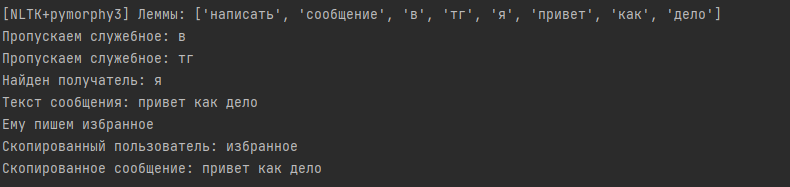
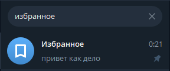
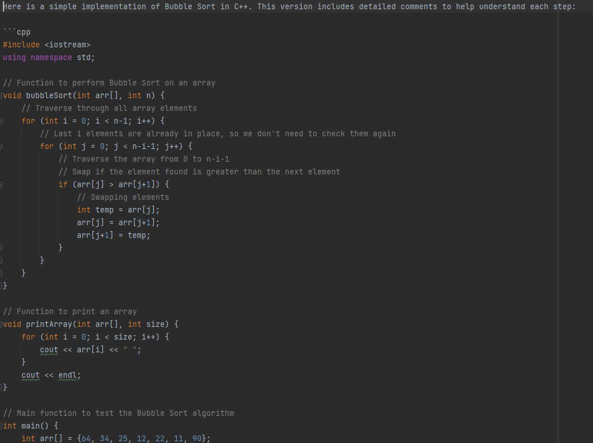

# Лабораторная работа №6: Голосовой ассистент

## 📝 Описание проекта

В рамках данной работы был разработан голосовой ассистент на Python. Модуль способен записывать команды с микрофона, распознавать речь, извлекать ключевые слова и выполнять соответствующие действия: от поиска в интернете до взаимодействия с локальной языковой моделью (LLM) для генерации кода.

## 🎯 Поставленные задачи

1.  **Реализовать модуль записи и распознавания речи** с микрофона с последующим извлечением ключевых слов для выполнения команд.
2.  **Создать виртуальное окружение** и установить необходимые библиотеки (`pyaudio`, `whisper`, `nltk`, `pymorphy3`).
3.  **Реализовать препроцессинг** голосовой команды (токенизация и лемматизация).
4.  **Реализовать выполнение следующих команд:**
    *   Генерация ссылки на поиск в браузере.
    *   Открытие видеофайла или поиск видео.
    *   Запуск мессенджера (Telegram) и ввод сообщения.
5.  **Интегрировать локальную LLM** через `Ollama` для ответов на запросы и генерации кода.
6.  **Продемонстрировать генерацию C++ кода** с алгоритмами сортировки посредством голосовых инструкций для LLM.

## ⚙️ Принцип работы

Ассистент работает по следующему пайплайну:
1.  **Запись голоса:** Скрипт ожидает активационную фразу, после чего записывает голосовую команду пользователя в `.wav` файл. Либо же можно использовать заранее записаный .txt файл с командами, которые также распознаются.
2.  **Распознавание речи:** Записанный аудиофайл передается в модель `OpenAI Whisper`, которая преобразует речь в текст.
3.  **Обработка текста:** Полученный текст проходит обработку:
    *   **Токенизация** с помощью `NLTK` для разделения текста на слова.
    *   **Лемматизация** с помощью `pymorphy3` для приведения слов к их начальной форме.
4.  **Исполнение команд:** Система анализирует обработанные слова, находит ключевые команды и выполняет соответствующее действие (`поиск`, `открыть`, `написать`, `сгенерируй код`).
5.  **Взаимодействие с LLM:** Для сложных запросов, таких как генерация кода, команда перенаправляется на локально запущенную модель через `Ollama API`.

## ✨ Примеры работы

### Поиск в браузере

Ассистент может принять поисковый запрос и автоматически открыть браузер с результатами.

*Рис. 1 — Консоль после распознавания команды "найди курс биткоина".*

*Рис. 2 — Автоматически открытая вкладка браузера с результатами поиска.*

### Управление Telegram

Реализована функция поиска контакта и отправки ему сообщения в Telegram.

*Рис. 3 — Распознанная команда на отправку сообщения.*

*Рис. 4 — Скрипт находит нужный диалог в Telegram.*

*Рис. 5 — Сообщение успешно напечатано и отправлено в выбранный чат.*

### Генерация кода с помощью LLM (Ollama)

Ассистент может передавать голосовые инструкции локальной языковой модели для генерации кода.

*Рис. 6 — Результат генерации C++ кода с алгоритмами сортировки по голосовому запросу "сгенерируй код на C++ пузырьком".*
