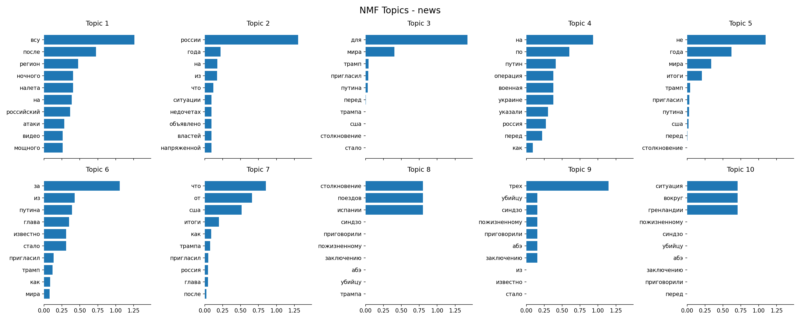
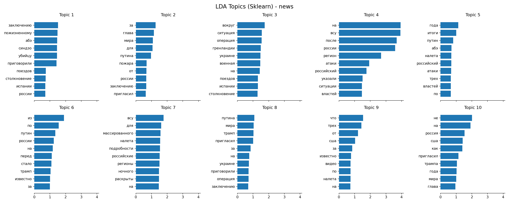
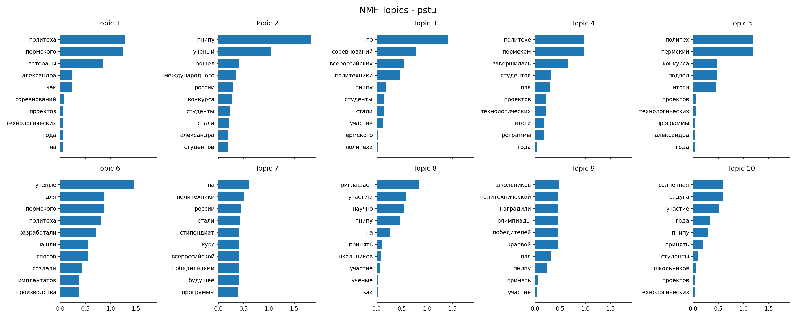
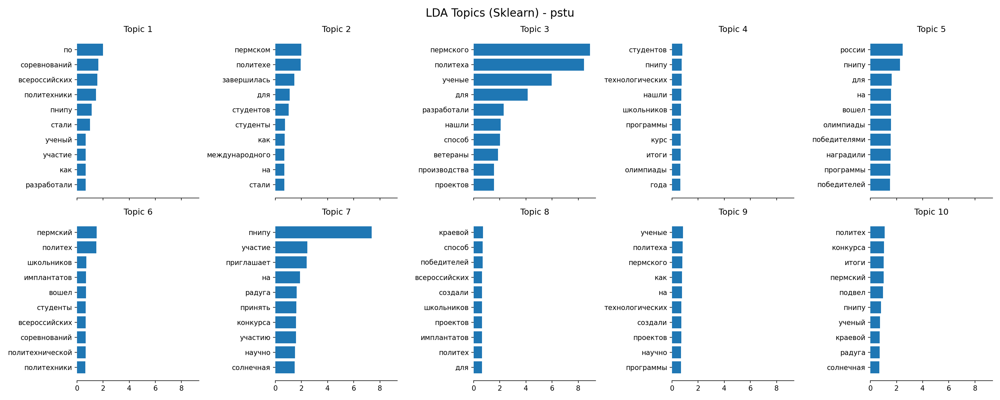

# Лабораторная работа №3: Тематическое моделирование веб-данных

## Описание

Система автоматического тематического моделирования для анализа и категоризации текстовых данных с применением методов латентного размещения Дирихле (LDA) и неотрицательного матричного разложения (NMF).

## Функциональность

- 🔤 **Предобработка текстов** - токенизация, лемматизация, удаление стоп-слов
- 📊 **NMF моделирование** - с использованием TF-IDF векторизации
- 🎯 **LDA моделирование** - через Scikit-learn и Gensim
- 📈 **Оценка качества** - Coherence Score для моделей
- 🎨 **Визуализация тем** - графики топ-слов и распределений
- 💾 **Экспорт результатов** - CSV, JSON, PNG

## Использование

### Обработка новостного датасета

```bash
python main.py --dataset news --limit 10
```

### Обработка датасета ПНИПУ

```bash
python main.py --dataset pstu --limit 10
```

### Настройка количества тем

```bash
python main.py --dataset news --n-topics 15
```

### Полный анализ

```bash
python main.py --dataset news
```

## Параметры командной строки

| Параметр | Описание | По умолчанию |
|----------|----------|--------------|
| `--dataset` | Датасет для анализа (news/pstu) | news |
| `--n-topics` | Количество тем | 10 |
| `--n-features` | Количество признаков | 100 |
| `--n-top-words` | Топ-слов в теме | 10 |
| `--limit` | Ограничение документов | None |

## Пример вывода

```
Loading news dataset...
Loaded 68 news articles

==================================================
Processing news dataset
Number of documents: 68
==================================================

After preprocessing: 68 documents

--- NMF with TF-IDF ---
Saved NMF visualization: news_nmf_topics.png
Saved NMF document topics: news_nmf_doc_topic.csv

--- LDA with Sklearn ---
Saved LDA visualization: news_lda_topics.png
Saved LDA document topics: news_lda_doc_topic.csv

--- LDA with Gensim ---
Coherence Score (Gensim LDA): 0.5058

Top words per topic (Gensim LDA):
Topic 1: 0.237*"на" + 0.156*"по" + 0.087*"россия" + 0.009*"заключению"
Topic 2: 0.152*"с" + 0.116*"в" + 0.078*"испании" + 0.078*"поездов"
Topic 3: 0.133*"военная" + 0.133*"операция" + 0.133*"украине"
...
Topic 10: 0.117*"о" + 0.091*"после" + 0.074*"на" + 0.072*"всу"

Completed processing news dataset!
```

## Результаты анализа

### Датасет новостей (68 документов)

**Coherence Score: 0.5058**

#### Обнаруженные темы (LDA):

1. **Международная политика** - россия, на, по, заключению
2. **ЧП и катастрофы** - испании, поездов, столкновение
3. **Военные действия** - военная, операция, украине
4. **Пожары и инциденты** - пожара, видео, мощного, налета
5. **Политика США-РФ** - трампа, путина, россия, пригласил
6. **Судебные дела** - приговорили, заключению, пожизненному, абэ
7. **Геополитика** - гренландии, путин, ситуация, вокруг
8. **Военные операции** - всу, массированного, налета, регионы
9. **Внутренняя политика** - россии, сша, что, года
10. **Региональные события** - после, атаки, властей, россии

### Датасет ПНИПУ (52 документа)

**Coherence Score: 0.4770**

#### Обнаруженные темы (LDA):

1. **Стипендиальные программы** - стипендиат, россии, победителями, курс
2. **Технологические проекты** - итоги, проектов, технологических, программы
3. **Университетские события** - пнипу, политехе, пермском, завершилась
4. **Научные исследования** - ученые, способ, нашли, производства
5. **Работа со школьниками** - приглашает, школьников, соревнований, участие
6. **Общие новости** - пермского, политеха, ученые
7. **Научные достижения** - разработали, ветераны, создали, имплантатов
8. **Конкурсы** - конкурса, итоги, подвел
9. **Студенческая жизнь** - радуга, солнечная, ученый
10. **Международное сотрудничество** - международного, вошел, студенты

## Визуализация

### Топ-слова по темам

Для каждой темы строится график с весами топ-слов:

```
Тема 1: Международная политика
━━━━━━━━━━━━━━━━━━━━━━━━━━━━━━━━━
россия     ████████████████ 0.237
на         ████████████ 0.156
по         ██████ 0.087
заключению ██ 0.009
```

### Распределение документов

CSV-файлы содержат вероятности принадлежности каждого документа к темам:

| doc_id | topic_0 | topic_1 | topic_2 | ... | topic_9 | dominant_topic |
|--------|---------|---------|---------|-----|---------|-----------------|
| 0 | 0.12 | 0.45 | 0.08 | ... | 0.03 | 1 |
| 1 | 0.67 | 0.05 | 0.11 | ... | 0.02 | 0 |

## Визуализация результатов

### Датасет новостей (News)

#### NMF с TF-IDF векторизацией



График показывает топ-10 слов для каждой из 10 тем, выявленных методом NMF. Размер столбца отражает вес слова в теме.

#### LDA моделирование



График показывает топ-10 слов для каждой из 10 тем, выявленных методом LDA через Scikit-learn. Coherence Score: **0.5058**

### Датасет ПНИПУ (PSTU)

#### NMF с TF-IDF векторизацией



График тематического моделирования новостей ПНИПУ методом NMF. Хорошо видны темы, связанные с научной деятельностью и университетской жизнью.

#### LDA моделирование



График тематического моделирования новостей ПНИПУ методом LDA. Coherence Score: **0.4770**. Выделяются темы о студентах, конкурсах, научных исследованиях.
